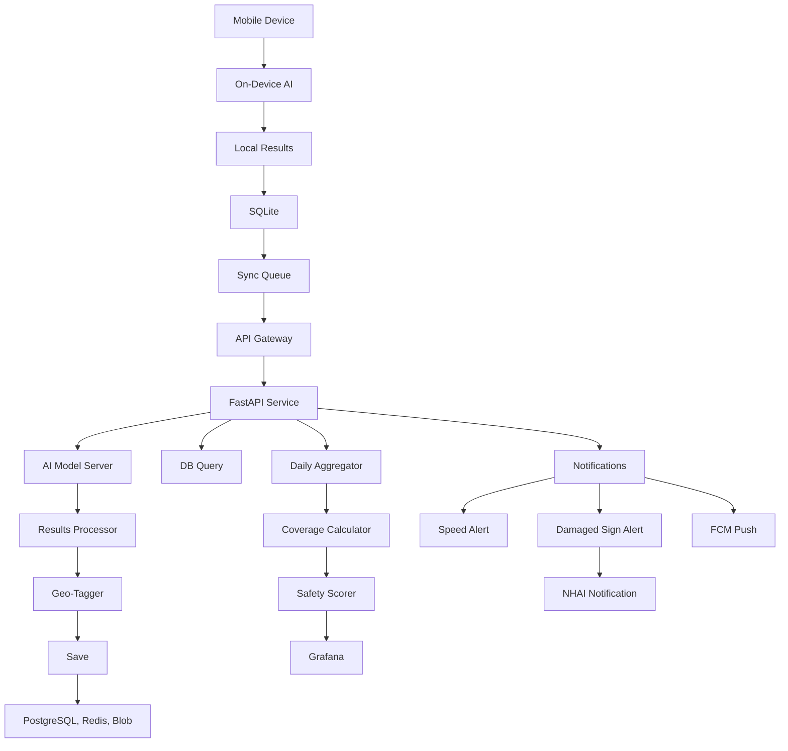

# Data Flow Architecture

```mermaid
graph TD
    MOBILE[Mobile Device] --> LOCAL[On-Device AI]
    LOCAL --> LOCALRES[Local Results]
    LOCALRES --> SQLITE[SQLite]
    SQLITE --> SYNC[Sync Queue]
    SYNC --> CLOUD[API Gateway]
    CLOUD --> FASTAPI[FastAPI Service]
    FASTAPI --> AI[AI Model Server]
    FASTAPI --> DBQ[DB Query]
    AI --> PROCESSOR[Results Processor]
    PROCESSOR --> GEOTAGGER[Geo-Tagger]
    GEOTAGGER --> SAVE[Save]
    SAVE --> STORAGE[PostgreSQL, Redis, Blob]
    FASTAPI --> ANALYTICS[Daily Aggregator]
    ANALYTICS --> COVERAGE[Coverage Calculator]
    COVERAGE --> SAFETY[Safety Scorer]
    SAFETY --> GRAFANA[Grafana]
    FASTAPI --> NOTIFY[Notifications]
    NOTIFY --> ALERT[Speed Alert]
    NOTIFY --> DAMAGED[Damaged Sign Alert]
    DAMAGED --> NHAI[NHAI Notification]
    NOTIFY --> FCM[FCM Push]
```
