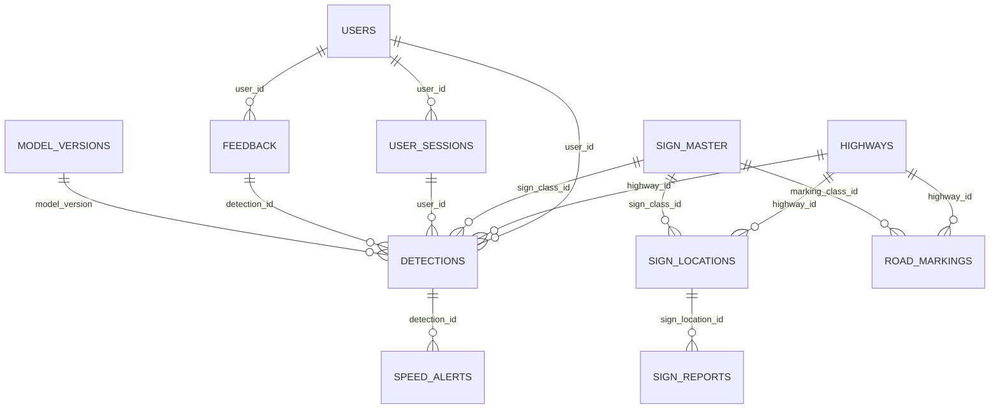

# Database ER Diagram

```mermaid
erDiagram
    USERS ||--o{ DETECTIONS : "user_id"
    USERS ||--o{ USER_SESSIONS : "user_id"
    USERS ||--o{ FEEDBACK : "user_id"
    HIGHWAYS ||--o{ DETECTIONS : "highway_id"
    HIGHWAYS ||--o{ SIGN_LOCATIONS : "highway_id"
    HIGHWAYS ||--o{ ROAD_MARKINGS : "highway_id"
    SIGN_MASTER ||--o{ DETECTIONS : "sign_class_id"
    SIGN_MASTER ||--o{ SIGN_LOCATIONS : "sign_class_id"
    SIGN_MASTER ||--o{ ROAD_MARKINGS : "marking_class_id"
    DETECTIONS ||--o{ SPEED_ALERTS : "detection_id"
    SIGN_LOCATIONS ||--o{ SIGN_REPORTS : "sign_location_id"
    USER_SESSIONS ||--o{ DETECTIONS : "user_id"
    FEEDBACK ||--o{ DETECTIONS : "detection_id"
    MODEL_VERSIONS ||--o{ DETECTIONS : "model_version"
```
