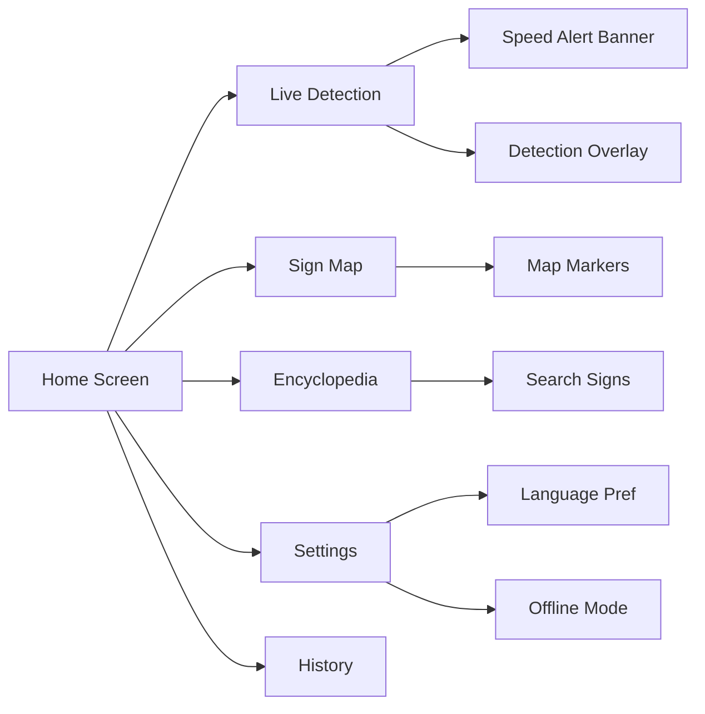

# Mobile App Screen Flow

```mermaid
graph LR
    HOME[Home Screen] --> DET[Live Detection]
    HOME --> MAP[Sign Map]
    HOME --> ENC[Encyclopedia]
    HOME --> SETT[Settings]
    HOME --> HIST[History]
    DET --> ALERT[Speed Alert Banner]
    DET --> OVERLAY[Detection Overlay]
    MAP --> MARKERS[Map Markers]
    ENC --> SEARCH[Search Signs]
    SETT --> LANG[Language Pref]
    SETT --> OFFMODE[Offline Mode]
```
