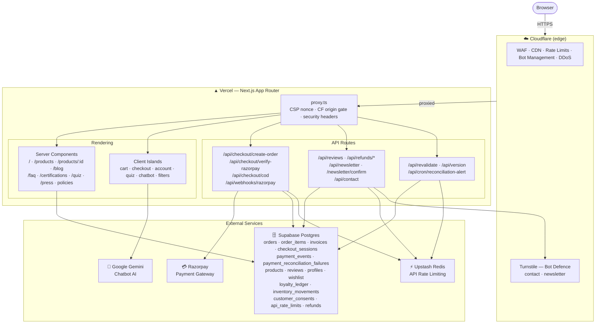

# VerdeBliss — Next.js Commerce Platform

VerdeBliss is a production-oriented D2C skincare storefront built with **Next.js App Router**, **TypeScript strict mode**, **Tailwind CSS**, **Supabase**, and **Razorpay**.

The architecture is server-first for SEO-critical routes and server-owned for payment/order integrity. Browser code never writes orders, payment events, loyalty points, or inventory movements directly.

## Architecture



## Key design decisions

- Server-owned Razorpay checkout sessions with server-side signature + amount verification.
- Raw-body Razorpay webhook verification; atomic order finalisation via `public.finalize_commerce_order(...)`.
- Inventory and loyalty updates run inside the database transaction.
- Redis/KV-first API rate limiting with Supabase durable fallback and per-identity (user/email/cart) second bucket.
- Per-request CSP nonce in `proxy.ts` with `strict-dynamic`; no `unsafe-inline` in `script-src`.
- Optional Cloudflare origin gate: `CF_ORIGIN_SECRET` header checked on `/api/*` (see `CLOUDFLARE_WAF.md`).
- ISR product pages purged post-deploy via `/api/revalidate` (requires `REVALIDATE_SECRET`).
- `LAUNCH_MODE=true` arms `tests/launch-gates.test.ts` compliance gates before live orders.

## Required environment variables

```env
NEXT_PUBLIC_SUPABASE_URL=
NEXT_PUBLIC_SUPABASE_ANON_KEY=
SUPABASE_SERVICE_ROLE_KEY=

# GitHub Actions: schema drift detection
SUPABASE_ACCESS_TOKEN=
SUPABASE_PROJECT_REF=
SUPABASE_DB_PASSWORD=

# Rate limiter — Upstash Redis REST or Vercel KV REST aliases.
# Must be HTTPS REST endpoints, not redis:// connection strings.
UPSTASH_REDIS_REST_URL=
UPSTASH_REDIS_REST_TOKEN=
# KV_REST_API_URL=
# KV_REST_API_TOKEN=

NEXT_PUBLIC_RAZORPAY_KEY_ID=
RAZORPAY_KEY_ID=
RAZORPAY_KEY_SECRET=
RAZORPAY_WEBHOOK_SECRET=

GEMINI_API_KEY=

NEXT_PUBLIC_TURNSTILE_SITE_KEY=
TURNSTILE_SECRET_KEY=
# Local development only: omit this in Vercel/production.
# TURNSTILE_ALLOW_DEV_BYPASS=true

# Public seller/compliance disclosure. Required for `npm run build` and all
# production deploys when NODE_ENV=production, VERCEL_ENV=production,
# LAUNCH_MODE=true, or VERDEBLISS_ENFORCE_COMPLIANCE=true.
# Define these in .env.local for local strict builds and in Vercel Project
# Settings → Environment Variables for production. See .env.example for the
# full list, including optional privacy/returns/press/order email aliases.
NEXT_PUBLIC_VERDEBLISS_LEGAL_NAME=
NEXT_PUBLIC_VERDEBLISS_CIN=
NEXT_PUBLIC_VERDEBLISS_GSTIN=
NEXT_PUBLIC_VERDEBLISS_REGISTERED_OFFICE_LINE1=
NEXT_PUBLIC_VERDEBLISS_REGISTERED_OFFICE_CITY=
NEXT_PUBLIC_VERDEBLISS_REGISTERED_OFFICE_STATE=
NEXT_PUBLIC_VERDEBLISS_REGISTERED_OFFICE_PINCODE=
NEXT_PUBLIC_VERDEBLISS_SUPPORT_PHONE_DISPLAY=
# Optional; derived from DISPLAY when omitted.
NEXT_PUBLIC_VERDEBLISS_SUPPORT_PHONE_HREF=
NEXT_PUBLIC_VERDEBLISS_SUPPORT_EMAIL=
# Must be the appointed person's real name. Known test/fake values are blocked.
NEXT_PUBLIC_VERDEBLISS_GRIEVANCE_OFFICER_NAME=
NEXT_PUBLIC_VERDEBLISS_GRIEVANCE_EMAIL=

# Post-deploy ISR cache purge (see PRODUCTION_RUNBOOK.md)
REVALIDATE_SECRET=

# Hourly reconciliation alert
CRON_SECRET=
OPS_ALERT_WEBHOOK_URL=

# Build identity — injected by CI
NEXT_PUBLIC_BUILD_SHA=
NEXT_PUBLIC_BUILD_TIME=
NEXT_PUBLIC_APP_VERSION=

# Optional
CF_ORIGIN_SECRET=           # Cloudflare origin gate (see CLOUDFLARE_WAF.md)
SENTRY_DSN=                 # Enables observability shim → Sentry forwarding
EXPOSE_BUILD_METADATA=      # Set true only for diagnostic windows; redacts Git rev in /api/version otherwise
LAUNCH_MODE=                # Set true in production before live orders; arms launch-gates tests
```

`/api/version` returns deployment metadata plus boolean capability flags for Supabase, Supabase admin, Razorpay, Turnstile, distributed rate limiting, and static-fallback mode.

## Local setup

```bash
npm ci
cp .env.example .env.local
npm run dev
```

## Database setup

Run in Supabase SQL editor:

```sql
-- 1. Main schema (idempotent — safe to rerun)
\i supabase/schema.sql

-- 2. Optional demo data
\i supabase/seed_test_data.sql
```

See `supabase/README_RUN_SCHEMA.md` for details.

## Razorpay setup

1. Add `RAZORPAY_KEY_ID`, `NEXT_PUBLIC_RAZORPAY_KEY_ID`, and `RAZORPAY_KEY_SECRET` to Vercel.
2. Add webhook URL in Razorpay dashboard:
   ```
   https://www.verdebliss.com/api/webhooks/razorpay
   ```
3. Add `RAZORPAY_WEBHOOK_SECRET` to Vercel.
4. Subscribe to payment `authorized`, `captured`, and `failed` events.
5. Monitor `payment_reconciliation_failures` and `[ALERT] payment_reconciliation_failed` log lines.

## Validation commands

```bash
npm run format:check
npm run lint
npm run typecheck
npm test -- --run
npm run build
```

CI gates (must pass before deploy):

```bash
npm run lint
npm run typecheck
npm run test:coverage
npm run build
npm run schema:drift
```

`npm run schema:drift` requires `SUPABASE_ACCESS_TOKEN`, `SUPABASE_PROJECT_REF`, and `SUPABASE_DB_PASSWORD` in GitHub secrets.

## Pre-launch checklist

Full checklist is in `PRODUCTION_RUNBOOK.md`. Key steps:

1. Replace every `DEMO` placeholder in `constants/businessCompliance.ts` and `constants/productCompliance.ts`.
2. Set `REVALIDATE_SECRET` in both GitHub Actions secrets and Vercel production env vars.
3. Set `CRON_SECRET` and `OPS_ALERT_WEBHOOK_URL`; confirm `/api/cron/reconciliation-alert` runs hourly.
4. Run `supabase/purge_seeded_reviews.sql` against the production DB.
5. Set `LAUNCH_MODE=true` in Vercel production and confirm `npm run test:coverage` still passes.

## Operational docs

- `PRODUCTION_RUNBOOK.md` — release checklist, ISR purge, LAUNCH_MODE gates, payment reconciliation, Razorpay capture mode, backup drills
- `CLOUDFLARE_WAF.md` — DNS setup, origin lock-down, WAF rules, rate-limit rules, bot management, rollback
- `docs/security-follow-ups.md` — intentional low-risk CSP/COEP follow-ups to revisit after vendor or styling-pipeline changes
- `docs/launch-review-seeding-plan.md` — sampling/PR-unit review plan with disclosure and launch coverage gates
- `supabase/README_RUN_SCHEMA.md` — schema idempotency notes, recommended run order
